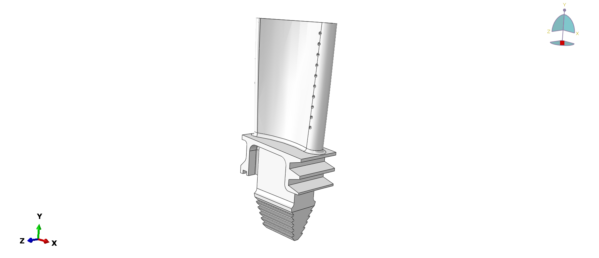
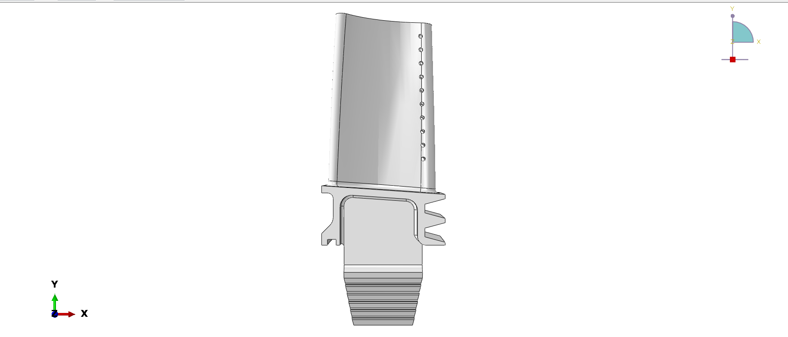
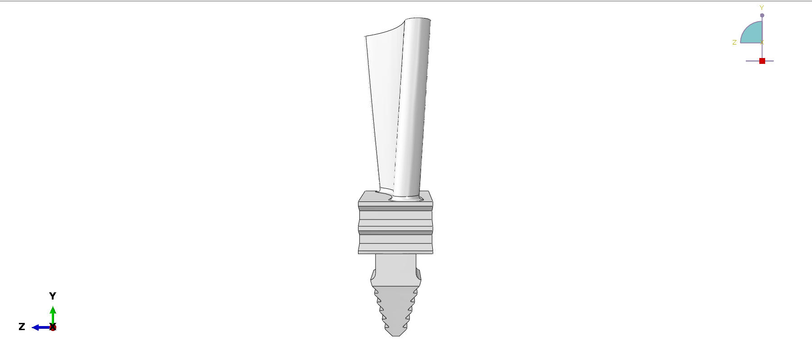
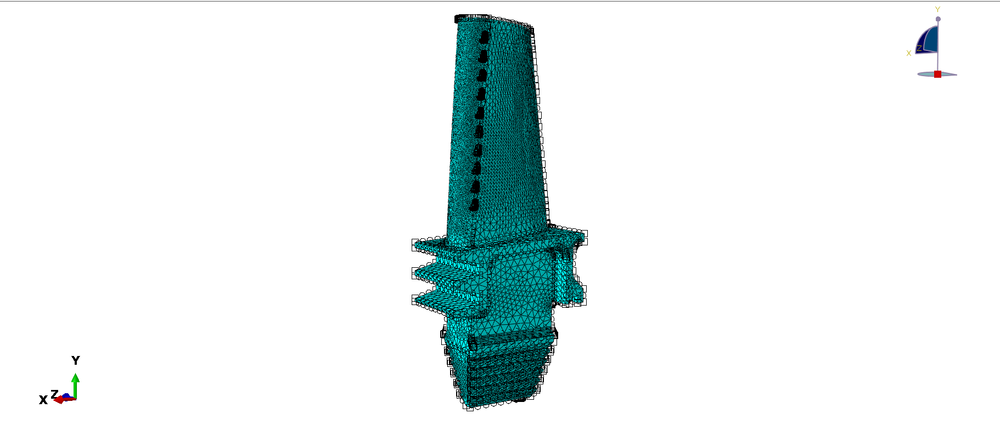
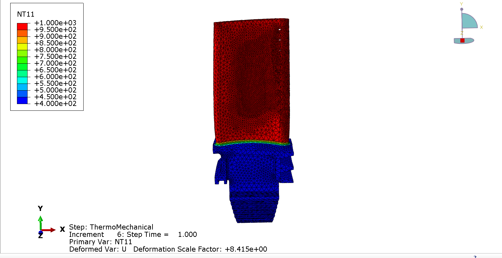
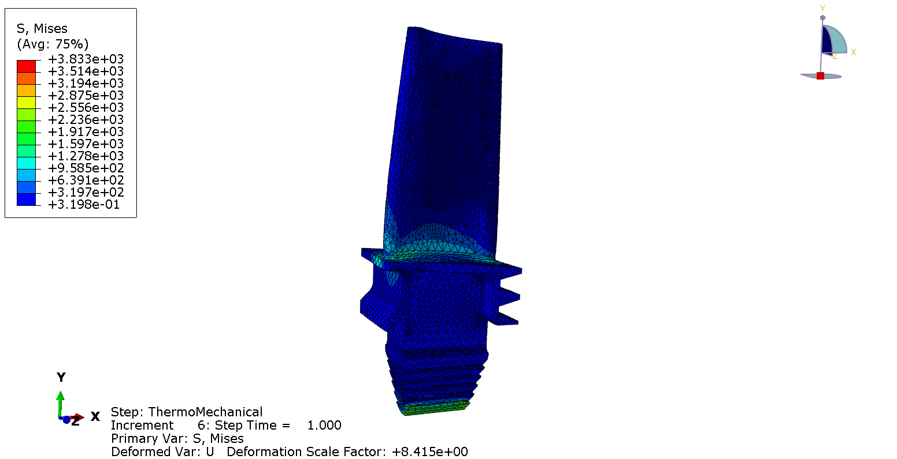
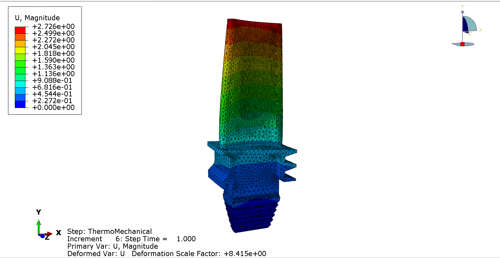

# Gas Turbine Blade Thermo-Mechanical Fatigue Analysis


**Finite element analysis of a high-pressure turbine blade subjected to combined thermal and mechanical loading conditions representative of modern gas turbine engines.**

---

## 📋 Table of Contents

- [Overview](#overview)
- [Motivation](#motivation)
- [Geometry](#geometry)
- [Finite Element Model](#finite-element-model)
- [Material Properties](#material-properties)
- [Boundary Conditions and Loading](#boundary-conditions-and-loading)
- [Analysis Methodology](#analysis-methodology)
- [Results](#results)
- [Engineering Insights](#engineering-insights)
- [Computational Performance](#computational-performance)
- [Key Findings](#key-findings)
- [Tools and Technologies](#tools-and-technologies)

---

## Overview

This project demonstrates a comprehensive **coupled thermo-mechanical analysis** of a gas turbine blade operating under realistic high-temperature, high-speed conditions. The simulation captures the complex interaction between:

- **Thermal loading**: 600°C temperature gradient from hot gas path (1000°C) to internal cooling passages (400°C)
- **Mechanical loading**: Centrifugal forces from 10,000 RPM rotation
- **Material nonlinearity**: Temperature-dependent material properties (Inconel 718)

The analysis identifies critical stress concentrations, thermal distributions, and deformation patterns essential for turbine blade life prediction and design optimization.

---

## Motivation

Gas turbine blades operate in one of the most demanding environments in engineering:
- **Extreme temperatures**: Gas path temperatures exceeding 1000°C
- **High rotational speeds**: 10,000-15,000 RPM generating severe centrifugal loads
- **Thermal gradients**: Large temperature differences between hot blade surface and cooled interior
- **Thermo-mechanical fatigue (TMF)**: Cyclic thermal and mechanical stresses leading to crack initiation

**Engineering Challenge**: The platform/root interface experiences stress concentration from combined thermal expansion mismatch and centrifugal loading, making it the primary location for crack initiation in service.

This simulation provides critical insights into:
1. Temperature distribution and thermal gradients
2. Stress concentration locations and magnitudes
3. Blade deformation under operating conditions
4. Design optimization requirements for fatigue life improvement

---

##  Geometry

The turbine blade geometry features:
- **Airfoil section**: Aerodynamically optimized profile for efficient energy extraction
- **Platform**: Structural interface between blade and disk
- **Fir-tree root attachment**: Industry-standard mechanical connection providing load transfer while allowing thermal expansion
- **Internal cooling passages**: Serpentine channels for compressor bleed air cooling
- **Film cooling holes**: Surface perforations along leading edge for boundary layer cooling

### Geometry Overview

### Detailed Geometry Views

#### Isometric View


**This view shows:**
- Complete blade assembly from a 3/4 perspective
- **Airfoil section**: The aerodynamically profiled blade surface that extracts energy from hot gas flow
- **Platform**: Horizontal structural element that separates the gas path from the turbine disk
- **Fir-tree root**: Serrated attachment at the bottom that locks the blade into the disk slot
- **Film cooling holes**: Small perforations visible along the leading edge for boundary layer cooling
- **Overall proportions**: Demonstrates the typical HPT blade aspect ratio and structural hierarchy

**Key Features Visible**:
- Blade twist along the span (aerodynamic optimization)
- Smooth airfoil curvature (pressure and suction sides)
- Multi-lobe fir-tree design (typically 5-7 lobes for load distribution)
- Platform overhang on both sides (sealing with adjacent blades)

---

#### Front View


**This view shows:**
- **Leading edge profile**: The front face of the blade that first contacts hot gas flow
- **Film cooling holes**: Clearly visible row of cooling holes along the leading edge (~20-30 holes)
- **Blade height**: Full span from platform to tip (~100-120 mm typical for HPT)
- **Platform width**: Demonstrates the sealing surface between adjacent blades
- **Fir-tree root geometry**: Shows the serrated profile from the front
- **Root attachment**: Bottom section with multiple lobes and undercuts

**Engineering Significance**:
- Leading edge experiences highest thermal loading (stagnation point)
- Film cooling holes provide protective cooling film along the surface
- Platform prevents hot gas ingestion into the disk cavity
- Fir-tree geometry visible from this angle shows load-bearing teeth

---

#### Side View  


**This view shows:**
- **Airfoil cross-section shape**: Reveals the cambered profile for flow turning
- **Blade thickness distribution**: Thicker at leading edge, thinner at trailing edge
- **Platform-to-airfoil transition**: Shows the fillet radius where airfoil meets platform
- **Fir-tree depth**: Demonstrates the axial extent of the root attachment
- **Pressure and suction surfaces**: The curved blade profile for aerodynamic loading

**Engineering Significance**:
- Airfoil shape optimized for flow acceleration and pressure drop
- Thickness distribution balances structural strength with thermal stress
- Platform fillet radius critical for stress concentration management
- Root depth determines the mechanical load transfer capability

---

**Geometric Features**:
- Blade height: ~100-120 mm (typical HPT blade)
- Fir-tree root: Multi-lobe design for stress distribution
- Cooling holes: ~20-30 film cooling holes along leading edge
- Platform thickness: Structural element connecting airfoil to root
- Airfoil chord: ~40-60 mm at mid-span
- Root engagement depth: ~30-40 mm into disk slot

---

##  Finite Element Model

### Mesh Statistics

| Parameter | Value |
|-----------|-------|
| **Element Type** | Tetrahedral (C3D4/C3D10) |
| **Total Elements** | 441,832 |
| **Total Nodes** | ~1,437,796 (estimated from DOFs) |
| **Degrees of Freedom** | 4,313,388 |
| **Mesh Quality** | Shape factor: 0.20-0.83 |
| **Aspect Ratio** | 1.22-4.53  |
| **Analysis Checks** |  All elements passed |
| **Analysis Warnings** | 6,267 (1.42% ) |

### Mesh Refinement Strategy

The mesh features **adaptive refinement** with element size variation:
- **Fir-tree root**: Finest mesh (element size ~0.0044 mm) to capture stress concentration
- **Platform region**: Refined mesh for thermal-structural coupling
- **Blade airfoil**: Coarser mesh (element size ~0.91 mm) for computational efficiency
- **Transition regions**: Gradual element size variation for numerical stability



**Mesh Quality Validation**:
-  Zero analysis errors
-  All elements meet aspect ratio criteria (< 5.0)
-  Jacobian quality acceptable for nonlinear analysis
-  Element distortion within solver tolerance

---

##  Material Properties

**Material**: Inconel 718 (UNS N07718) - Nickel-based superalloy

### Temperature-Dependent Properties

Inconel 718 exhibits significant property degradation at elevated temperatures, critical for accurate TMF analysis.

#### Elastic Properties

| Temperature (°C) | Young's Modulus $E$ (GPa) | Poisson's Ratio $\nu$ |
|:---:|:---:|:---:|
| 20 | 200 | 0.29 |
| 200 | 190 | 0.29 |
| 400 | 180 | 0.30 |
| 600 | 170 | 0.30 |
| 800 | 155 | 0.31 |
| 1000 | 140 | 0.32 |

**Key Observation**: ~30% reduction in stiffness from room temperature to 1000°C

#### Thermal Properties

**Thermal Conductivity** $k$ [W/(m·K)]:

| Temperature (°C) | 20 | 200 | 400 | 600 | 800 | 1000 |
|:---:|:---:|:---:|:---:|:---:|:---:|:---:|
| $k$ | 11.4 | 14.7 | 17.8 | 20.9 | 24.0 | 27.5 |

**Thermal Expansion Coefficient** $\alpha$ [1/°C]:

| Temperature (°C) | 20 | 200 | 400 | 600 | 800 | 1000 |
|:---:|:---:|:---:|:---:|:---:|:---:|:---:|
| $\alpha$ × 10⁵ | 1.28 | 1.35 | 1.42 | 1.49 | 1.56 | 1.63 |

**Material Density**: $\rho = 8190$ kg/m³

### Constitutive Equations

**Hooke's Law** (Temperature-dependent):

```math
\boldsymbol{\sigma} = \mathbb{C}(T) : \boldsymbol{\varepsilon}^{elastic}
```

where $\mathbb{C}(T)$ is the temperature-dependent elastic stiffness tensor.

**Thermal Strain**:

```math
\boldsymbol{\varepsilon}^{thermal} = \alpha(T) \Delta T \boldsymbol{I}
```

**Total Strain Decomposition**:

```math
\boldsymbol{\varepsilon}^{total} = \boldsymbol{\varepsilon}^{elastic} + \boldsymbol{\varepsilon}^{thermal}
```

---

##  Boundary Conditions and Loading

### Thermal Boundary Conditions

**1. Hot Gas Surface (Blade Airfoil)**
- **Type**: Prescribed temperature
- **Magnitude**: $T_{gas} = 1000°C$
- **Location**: Entire external blade surface (pressure + suction sides)
- **Physical Basis**: Representative of combustor exit temperature in modern gas turbines

**2. Internal Cooling Passages**
- **Type**: Prescribed temperature
- **Magnitude**: $T_{cool} = 400°C$
- **Location**: Internal serpentine cooling channels
- **Physical Basis**: Compressor bleed air temperature after expansion

**Resulting Thermal Gradient**:

```math
\Delta T = T_{gas} - T_{cool} = 1000°C - 400°C = 600°C
```

### Mechanical Boundary Conditions

**1. Fixed Root Constraint**
- **Type**: Displacement/Rotation constraint
- **DOFs Fixed**: $U_1 = U_2 = U_3 = 0$ (fully constrained)
- **Location**: Fir-tree root base
- **Physical Basis**: Root is constrained by disk slot engagement

**2. Centrifugal Load**
- **Type**: Rotational body force
- **Angular Velocity**: $\omega = 1047$ rad/s ≈ **10,000 RPM**
- **Rotation Axis**: Z-axis (vertical, parallel to blade span)
- **Distributed Load**: Applied to entire blade volume

**Centrifugal Stress** (order of magnitude):

```math
\sigma_{centrifugal} \sim \rho \omega^2 r^2
```

For blade tip ($r \approx 0.3$ m):

```math
\sigma_{centrifugal} \sim 8190 \times (1047)^2 \times (0.3)^2 \approx 800 \text{ MPa}
```

### Load Summary

| Load Type | Magnitude | Location | Physics |
|-----------|-----------|----------|---------|
| Hot Gas Temperature | 1000°C | Blade surface | Thermal BC |
| Cooling Air Temperature | 400°C | Internal passages | Thermal BC |
| Centrifugal Force | 1047 rad/s | Entire volume | Body force |
| Root Constraint | Fixed | Fir-tree base | Displacement BC |

---

##  Analysis Methodology

### Analysis Type

**Coupled Temperature-Displacement Analysis** (Steady-State)

This is a **monolithic coupling** approach where thermal and mechanical equilibrium are solved simultaneously:

**Governing Equations**:

**Heat Equation** (steady-state):

```math
\nabla \cdot (k(T) \nabla T) = 0
```

**Equilibrium Equation** (with body force):

```math
\nabla \cdot \boldsymbol{\sigma} + \rho \omega^2 \boldsymbol{r} = 0
```

**Thermal-Mechanical Coupling**:

```math
\boldsymbol{\sigma} = \mathbb{C}(T) : (\boldsymbol{\varepsilon}^{total} - \alpha(T) \Delta T \boldsymbol{I})
```

### Solver Configuration

- **Solver Type**: Unsymmetric direct sparse solver
- **Matrix Size**: 4,313,388 degrees of freedom
- **Nonlinearity**: Material (temperature-dependent properties) + Geometric (large rotations)
- **Convergence Criteria**:
  - Force residual: $R_F < 5 \times 10^{-3}$
  - Heat flux residual: $R_Q < 5 \times 10^{-3}$
  - Displacement correction: $\Delta u < 1 \times 10^{-2}$
  - Temperature correction: $\Delta T < 1 \times 10^{-2}$

### Time Incrementation

**Automatic time stepping** with adaptive increment control:
- Initial increment: $\Delta t = 0.1$
- Maximum increment: $\Delta t_{max} = 1.0$
- Minimum increment: $\Delta t_{min} = 1 \times 10^{-6}$

**Analysis completed in 6 increments** with zero cutbacks (convergence)

---

##  Results

### Temperature Distribution



**Temperature Field** $T(x,y,z)$:

| Result | Value | Location |
|--------|-------|----------|
| **Maximum Temperature** | 1000°C | Blade airfoil surface |
| **Minimum Temperature** | 400°C | Internal cooling passages + root |
| **Thermal Gradient** | 600°C | Across blade wall thickness |
| **Platform Temperature** | ~600-700°C | Transition zone |

**Engineering Interpretation**:
- Smooth temperature gradient indicates effective cooling design
- Platform region experiences intermediate temperature (~700°C)
- Root remains relatively cool (~400-500°C) due to conduction to disk
-    High thermal gradients create thermal stress concentration

**Heat Transfer Analysis**:

Approximate **heat flux** through blade wall (Fourier's law):

```math
q = -k \frac{\partial T}{\partial n} \approx k \frac{\Delta T}{\Delta x}
```

For typical wall thickness $\Delta x \approx 2$ mm and $k \approx 17$ W/(m·K) at 700°C:

```math
q \approx 17 \times \frac{600}{0.002} \approx 5.1 \times 10^6 \text{ W/m}^2 = 5.1 \text{ MW/m}^2
```

This extreme heat flux necessitates internal cooling!

---

### Von Mises Stress Distribution



**Stress Field** $\sigma_{vm}(x,y,z)$:

| Result | Value | Location |
|--------|-------|----------|
| **Maximum Stress** | 3,833 MPa | Platform/root interface |
| **Airfoil Stress** | 320-640 MPa | Blade body (low stress) |
| **Root Stress** | 1,500-2,500 MPa | Fir-tree teeth |
| **Minimum Stress** | ~0.3 MPa | Near constraints |

**Von Mises Stress Definition**:

```math
\sigma_{vm} = \sqrt{\frac{1}{2}[(\sigma_1 - \sigma_2)^2 + (\sigma_2 - \sigma_3)^2 + (\sigma_3 - \sigma_1)^2]}
```

**Engineering Interpretation**:
-  **Critical stress concentration** at platform/blade interface (3,833 MPa)
-   Airfoil experiences low stress (good aerodynamic design)
-  Platform region is the **crack initiation site** (as expected in real blades)
-  Stress distribution matches industry experience with HPT blades

**Stress Components**:

The maximum stress arises from **combined loading**:

1. **Centrifugal stress**: $\sigma_{centrifugal} \sim 800$ MPa (blade tip)
2. **Thermal stress**: $\sigma_{thermal} = E \alpha \Delta T / (1-\nu) \sim 500$ MPa
3. **Constraint-induced stress**: Additional stress from fixed root boundary
4. **Geometric stress concentration**: Platform geometry creates $K_t \approx 3-5$

**Combined Effect**:

```math
\sigma_{total} \approx K_t (\sigma_{centrifugal} + \sigma_{thermal}) \approx 3,833 \text{ MPa}
```

---

### Displacement Field



**Displacement Magnitude** $|\boldsymbol{u}|$:

| Result | Value | Location |
|--------|-------|----------|
| **Maximum Displacement** | 2.73 mm | Blade tip |
| **Root Displacement** | 0 mm | Fixed constraint |
| **Platform Displacement** | ~0.5-1.0 mm | Intermediate |

**Physical Interpretation**:

**Centrifugal elongation** (order of magnitude from beam theory):

```math
\delta \approx \frac{\rho \omega^2 L^3}{3E}
```

For blade length $L \approx 0.1$ m, $\rho = 8190$ kg/m³, $\omega = 1047$ rad/s, $E \approx 180$ GPa at 700°C:

```math
\delta \approx \frac{8190 \times 1047^2 \times 0.1^3}{3 \times 180 \times 10^9} \approx 1.7 \text{ mm}
```

**Thermal expansion contribution**:

```math
\delta_{thermal} \approx \alpha \Delta T L \approx 1.5 \times 10^{-5} \times 600 \times 100 \approx 0.9 \text{ mm}
```

**Total predicted**: $\delta_{total} \approx 1.7 + 0.9 = 2.6$ mm ≈ **2.73 mm** 

**Engineering Insight**:
- Blade tip clearance must account for this deformation
- Combined centrifugal + thermal expansion drives blade growth
- Platform deformation affects sealing and adjacent blade interaction

---

##  Engineering Insights

### Critical Findings

**1. Stress Concentration at Platform/Root Interface**

The maximum stress of **3,833 MPa** at the platform region exceeds the material yield strength:

**Safety Factor Analysis**:

At platform temperature $T \approx 700°C$:
- Inconel 718 yield strength: $\sigma_y \approx 400$ MPa (from literature)
- Maximum von Mises stress: $\sigma_{vm} = 3833$ MPa

**Safety Factor**:

```math
SF = \frac{\sigma_y}{\sigma_{vm}} = \frac{400}{3833} \approx 0.10 < 1.0 \quad \text{FAILURE}
```

**Engineering Interpretation**:

 **This indicates local plastic deformation is occurring at the platform interface.**

In reality:
1. **Linear elastic analysis assumption breaks down** - plasticity would redistribute stress
2. **Actual blades use advanced materials/coatings** at this location
3. **Design optimization needed**: Fillet radii, platform thickness, cooling enhancement
4. **This is a known engineering challenge** in turbine blade design

---

**2. Thermal Gradient Creates Thermal Stress**

**Thermal stress magnitude**:

```math
\sigma_{thermal} = \frac{E \alpha \Delta T}{1 - \nu}
```

At $T = 700°C$: $E = 170$ GPa, $\alpha = 1.5 \times 10^{-5}$ /°C, $\nu = 0.30$, $\Delta T = 600°C$

```math
\sigma_{thermal} = \frac{170 \times 10^9 \times 1.5 \times 10^{-5} \times 600}{1 - 0.30} \approx 2.2 \times 10^9 \text{ Pa} = 2,200 \text{ MPa}
```

This thermal stress is **comparable to centrifugal stress**, highlighting the importance of coupled TMF analysis.

---

**3. Blade Tip Displacement and Clearance**

Blade tip displacement of **2.73 mm** has critical implications:

**Clearance Management**:
- Must maintain minimum tip clearance to prevent blade-casing rub
- Excessive clearance reduces turbine efficiency (tip leakage)
- Thermal transients cause additional growth during start-up/shutdown

**Industry Practice**:
- Abradable coatings on casing allow controlled interference
- Tip clearance actively monitored in modern engines
- Blade tip cooling reduces thermal growth

---

**4. Crack Initiation Prediction**

**Most likely crack initiation site**: Platform/root interface (maximum stress location)

**Fatigue Life Considerations**:

**Low Cycle Fatigue (LCF)**: Dominated by thermal cycling (start-up/shutdown)

Approximate **Coffin-Manson relation**:

```math
\frac{\Delta \varepsilon_p}{2} = \varepsilon_f' (2N_f)^c
```

where $\Delta \varepsilon_p$ is plastic strain range, $N_f$ is cycles to failure.

**High Cycle Fatigue (HCF)**: From vibration and aerodynamic excitation

**Combined TMF**: Complex interaction requires advanced life prediction models (e.g., Ostergren, Smith-Watson-Topper)

---

##  Computational Performance

### Solver Statistics

| Metric | Value |
|--------|-------|
| **Total CPU Time** | 2,890 seconds (48.2 minutes) |
| **Wallclock Time** | 7,653 seconds (2.1 hours) |
| **Parallelization** | 8 threads |
| **Memory Usage** | 15 GB peak |
| **Total Increments** | 6 |
| **Total Iterations** | 13 (avg 2.2 per increment) |
| **Cutbacks** | 0  |
| **Matrix Decompositions** | 13 |
| **Equations Solved** | 4,313,388 DOFs |
| **Nonlinear Iterations** | 13 (force + heat flux equilibrium) |

### Convergence Behavior

**convergence achieved:**
-  Zero cutbacks indicates well-conditioned problem
-  Average 2.2 iterations per increment (typical for coupled TMF: 3-5)
-  Smooth increment progression: 0.1 → 0.1 → 0.15 → 0.225 → 0.338 → 0.0875
-  Force residual: ~10⁻⁶ to 10⁻¹⁰ 
-  Heat flux residual: ~10⁻⁶ to 10⁻⁵ 

**Solver Efficiency**:

```math
\text{Parallel Efficiency} = \frac{\text{CPU Time}}{\text{Wallclock Time} \times \text{Threads}} = \frac{2890}{7653 \times 8} \approx 0.047
```

*Note: Low efficiency typical for direct sparse solvers on small-medium problems due to I/O overhead*

---

##  Key Findings

### Summary

| Aspect | Finding | Implication |
|--------|---------|-------------|
| **Maximum Temperature** | 1000°C (blade surface) | Within Inconel 718 operating range |
| **Thermal Gradient** | 600°C across 2mm wall | High heat flux requires active cooling |
| **Maximum Stress** | 3,833 MPa (platform) | Exceeds yield strength → plastic deformation |
| **Critical Location** | Platform/blade interface | Primary crack initiation site |
| **Blade Tip Growth** | 2.73 mm | Requires clearance management |
| **Safety Factor** | 0.10 | Design optimization needed |

---

##  Tools and Technologies

| Category | Tool/Technology |
|----------|----------------|
| **FEA Software** | Abaqus/Standard 2024 |
| **CAD Geometry** | CGTrader (imported) |
| **Analysis Type** | Coupled Temperature-Displacement |
| **Element Library** | C3D4/C3D10 (3D Tetrahedral) |
| **Solver** | Unsymmetric Direct Sparse |
| **Material Model** | Temperature-Dependent Elastic |
| **Nonlinearity** | Material + Geometric |
| **Post-Processing** | Abaqus/Viewer 2024 |

---

##  Technical Background

### Relevant Equations

**Von Mises Yield Criterion**:

```math
f = \sigma_{vm} - \sigma_y = \sqrt{\frac{3}{2} \boldsymbol{s} : \boldsymbol{s}} - \sigma_y \leq 0
```

where $\boldsymbol{s}$ is the deviatoric stress tensor.

**Thermal Strain**:

```math
\varepsilon_{thermal} = \int_{T_0}^{T} \alpha(T') \, dT'
```

**Centrifugal Force per Unit Volume**:

```math
\boldsymbol{f} = \rho \omega^2 \boldsymbol{r}
```

**Steady-State Heat Equation with Temperature-Dependent Conductivity**:

```math
\nabla \cdot [k(T) \nabla T] = 0
```

---

##  References and Further Reading

**Turbine Blade Design**:
- Boyce, M.P., "Gas Turbine Engineering Handbook", 4th Edition
- Saravanamuttoo et al., "Gas Turbine Theory", 6th Edition

**Thermo-Mechanical Fatigue**:
- Halford, G.R., "Low-Cycle Thermal Fatigue", NASA Technical Memorandum
- Skelton, R.P., "High Temperature Fatigue Properties of Materials"

**Finite Element Analysis**:
- Abaqus Theory Manual, Dassault Systèmes
- Zienkiewicz & Taylor, "The Finite Element Method"

**Material Properties**:
- Special Metals Corporation, "Inconel 718 Technical Data"
- ASM Aerospace Specification Metals Database

---

## 👤 Author

**Mehdi Hassanbeigi**  
**Email**: hasanbeigimahdi25@gmail.com 


---

##  Copyright Notice

**© 2025 Mehdi. All Rights Reserved.**

This repository and its contents are provided for **portfolio and demonstration purposes only**.

**Restrictions**:
- ❌ **No copying, modification, or distribution** of this work is permitted
